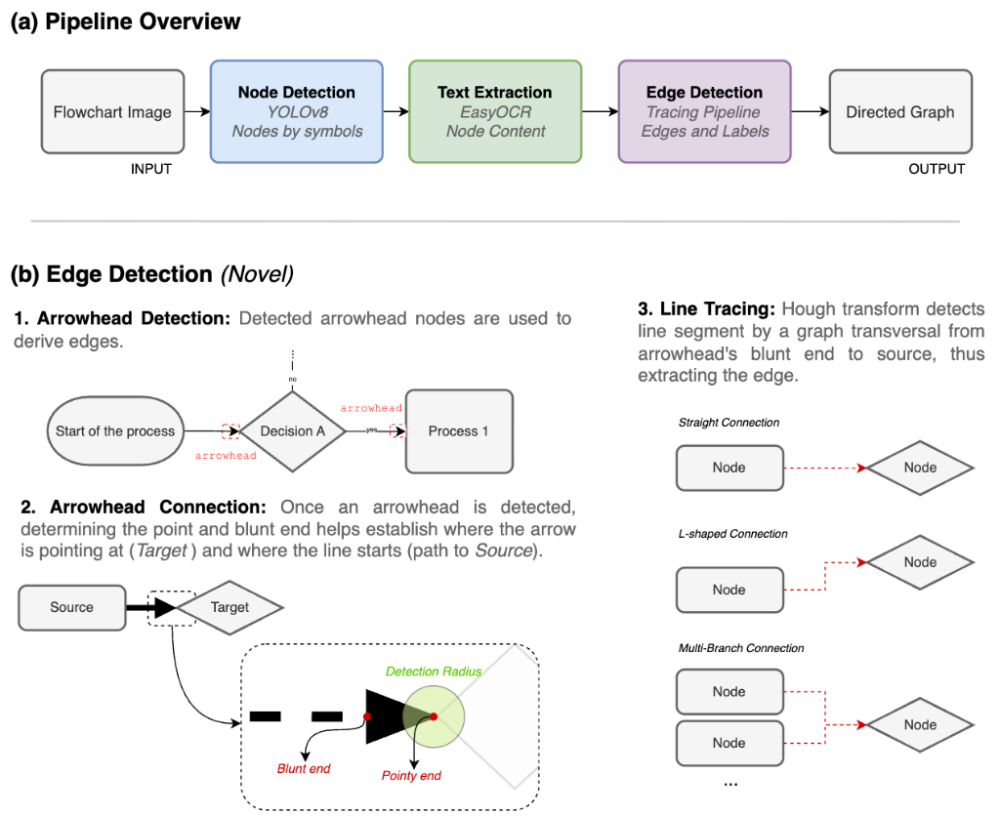
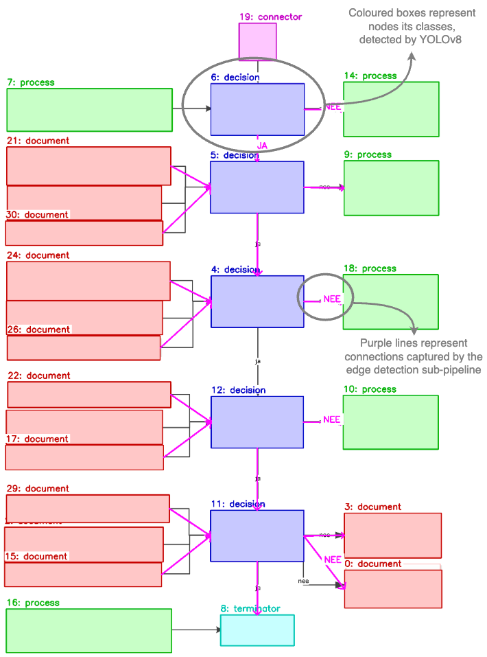

# FlowExtract: Procedural Knowledge Extraction from Maintenance Flowcharts

[](https://creativecommons.org/licenses/by-nc/4.0/)

Official repository for the (submitted) APMS 2026 paper: **"FlowExtract: Procedural Knowledge Extraction from Maintenance Flowcharts"**.

## Overview

Maintenance procedures in manufacturing facilities are often documented as flowcharts in static PDFs or scanned images. These documents encode procedural knowledge essential for asset lifecycle management but remain inaccessible to modern operator support systems. While Vision-Language Models (VLMs) struggle to reconstruct complex connection topologies from such diagrams, **FlowExtract** offers a robust, hybrid alternative.

FlowExtract is a pipeline that deliberately separates element detection from connectivity reconstruction:
1. **Node Detection**: Single-stage object detection (YOLOv8s) localized and classified symbols.
2. **Text Extraction**: Deep-learning OCR (EasyOCR) extracts node content.
3. **Edge Extraction**: Classical line-tracing (Hough Transform) derives directed graphs from detected arrowheads.

By focusing on high precision rather than forced recall, FlowExtract is explicitly designed for **Human-in-the-Loop (HITL)** workflows. The system provides a highly reliable structural skeleton of the standard operating procedure, allowing human validators to efficiently contribute completeness without having to untangle hallucinatory cross-links.

<p align="center">
  
</p>

## Key Features & Results

Evaluated on a dataset of real-world ISO 5807-standardized industrial troubleshooting guides, FlowExtract substantially outperforms state-of-the-art vision-language model baselines (such as Qwen2-VL-7B and Pixtral-12B) on graph extraction tasks.

* **Node Detection (F1)**: `98.8%` *(vs best VLM: 34.0%)*
* **Edge Detection (F1)**: `66.7%` *(vs best VLM: 10.7%)*
* **Edge Precision**: `85.5%`

### Qualitative Performance

The pipeline successfully handles dense technical terminology, tightly spaced nodes, and overlapping edges, tracing multi-branching procedural paths accurately.

<p align="center">
  
</p>
<p align="center">
  <em>The original textual content within the nodes has been computationally redacted to anonymize proprietary procedural data, while preserving the structural morphology.</em>
</p>

---

## Getting Started

### Prerequisites
* Python 3.9+
* [Tesseract](https://github.com/tesseract-ocr/tesseract) (required by EasyOCR depending on OS)
* MacOS M-series or CUDA-compatible GPU recommended for YOLO inference.

### Installation

1. Clone the repository:
   ```bash
   git clone https://github.com/guille-gil/FlowExtract.git
   cd FlowExtract
   ```

2. Create a virtual environment and install dependencies:
   ```bash
   python -m venv .venv
   source .venv/bin/activate  # On Windows: .venv\Scripts\activate
   pip install -r requirements.txt
   ```

3. Download the pre-trained model weights (if hosted externally) and place them in:
   `runs/detect/train/weights/best.pt`

## Repository Structure

```text
FlowExtract/
├── docs/                      # Auxiliary documentation and paper figures
├── data/
│   ├── input/                 # Raw legacy PDFs/images and YOLO annotations
│   ├── intermediate/          # Output of intermediate pipeline stages
│   └── output/                # Final JSON graphs and metric charts
├── scripts/
│   ├── train_yolo.py          # Script for fine-tuning YOLOv8s
│   └── generate_figure.py     # Qualitative validation chart generation
├── src/                       
│   ├── pipeline/              # Modulized extraction pipeline (Stages 1-3)
│   ├── utils/                 # Bounding box spatial heuristics & visualization
│   ├── main.py                # Main operational script
│   └── evaluate.py            # End-to-end ground-truth metric evaluation
└── README.md
```

## Usage

### 1. Running the Pipeline
To extract a directed graph from a raw flowchart image, run the main entry point:

```bash
python src/main.py
```
This will parse the files in `data/input/images/test/` and output the structural JSON graphs to `data/intermediate/arrows/`.

### 2. Evaluating Metrics
To replicate the evaluation results found in the paper, execute the evaluation script. This will compare the extracted JSON graphs against the `data/input/final_annotations` ground truth:

```bash
python src/evaluate.py --charts
```
Evaluation metrics will be printed to stdout, and publication-ready charts (like the ones generated for APMS) will be saved to `data/output/charts/`.

*Note: The Vision-Language Model (VLM) baseline results reported in our paper are evaluated on the same dataset in our prior work. If you reference those comparisons, please cite:*
```bibtex
@article{gilavalle2026procedural,
  title={Procedural Knowledge Extraction from Industrial Troubleshooting Guides Using Vision Language Models},
  author={Gil de Avalle, Guillermo and Maruster, Laura and Emmanouilidis, Christos},
  journal={arXiv preprint arXiv:2601.22754},
  year={2026}
}
```

---

<!-- 
## Citation

If you use FlowExtract in your research, please cite our APMS 2026 paper:

```bibtex
@inproceedings{gil2026flowextract,
  title={FlowExtract: Procedural Knowledge Extraction from Maintenance Flowcharts},
  author={Gil de Avalle, Guillermo and Maruster, Laura and Sloot, Eric and Emmanouilidis, Christos},
  booktitle={Advances in Production Management Systems (APMS)},
  year={2026},
  organization={Springer}
}
```
-->

## License

This project is licensed under the **Creative Commons Attribution-NonCommercial 4.0 International (CC BY-NC 4.0)** license. See the [LICENSE](LICENSE) file for details.
